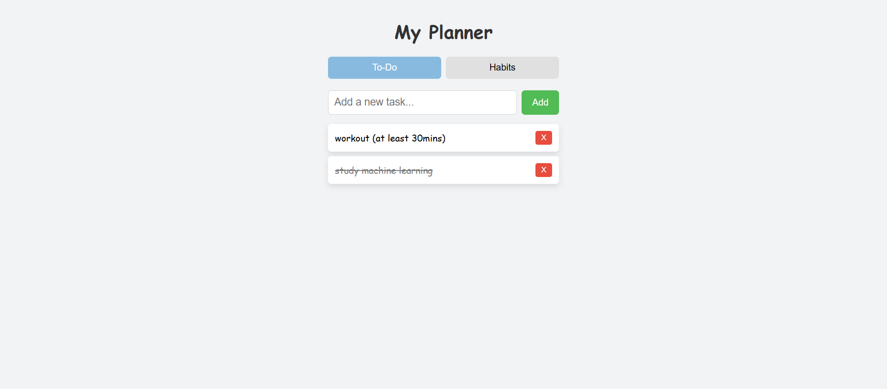
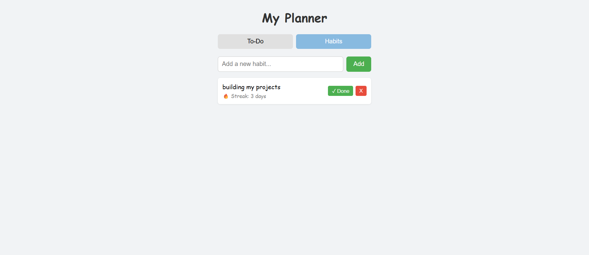

# Habit Tracker & To-Do List

A simple web app to manage daily tasks and build habits with streak tracking.
Built with vanilla HTML, CSS, and JavaScript.

## Screenshots




## Features

- Add, complete, and delete tasks
- Track daily habits with a check-in button
- Automatic streak calculation based on consecutive days
- Data persists after refresh using localStorage
- Tab navigation between To-Do and Habits

## Tech Stack

- HTML5
- CSS3 (Flexbox)
- JavaScript (DOM manipulation, localStorage)

## How to Run

1. Clone the repository:

```bash
   git clone https://github.com/liyuantiang/habit-tracker.git
```

2. Open the folder in VS Code.
3. Open `index.html` with Live Server (or double-click it in your browser).

## What I Learned

- **State-driven rendering**: keeping data in an array and re-rendering the
  page after every change (update data → save → render).
- **Streak algorithm**: counting backwards from today (or yesterday if today
  isn't checked in yet) until a missed day is found.
- **Git workflow**: resolving a diverged history with `git pull` and merge.

## Future Plans

- Python (Flask) backend with SQLite database
- Deploy online
- Weekly habit view and dark mode